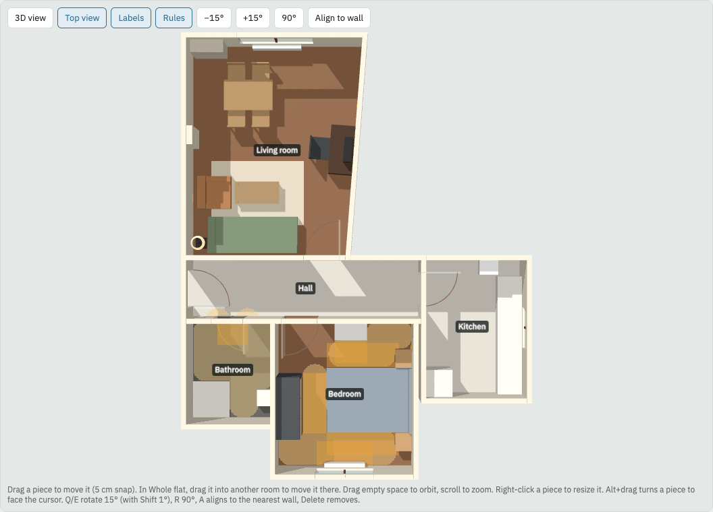
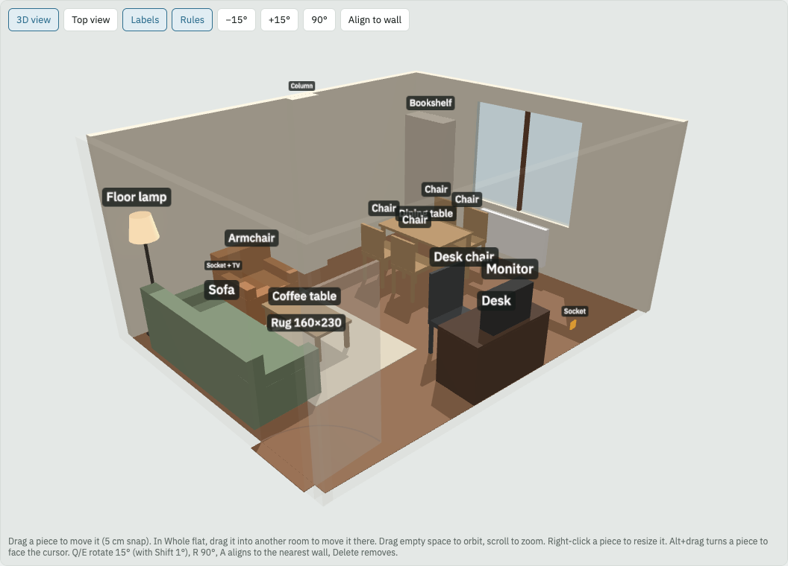

# flat-planner

Plan furniture in your real flat together with an AI coding agent (Claude Code or Codex). The agent turns a hand drawing, a few photos and a tape measure into a 3D model. Then it checks every arrangement against hard rules: walkways, door swings, radiators, bed access, daylight at the desk.



## Why

Room planners make it easy to drag a sofa around a perfect rectangle. Real flats are not rectangles. Walls run at an angle, columns stick out, and the tape reading you took over the sofa was 10 cm off. Most of the work is getting from a messy flat to a model you can trust. That is the part this project does with you.

- **Every number says where it came from:** a sketch, a photo, a guess, or a tape measure. The model renders from the first rough sketch, and `flat-planner survey` tells you which measurement to take next.
- **Redundant measurements catch reading errors.** If the parts of a wall do not add up to the whole, you hear about it before you buy a wardrobe that will not fit.
- **The agent can see.** `flat-planner snap` renders the plan to an image, so the agent looks at what you see before it answers.
- **Rules, not vibes.** `flat-planner check` reports overlaps, walls, door and drawer swings, radiator and boiler clearance, 60 and 80 cm walkways from the front door, bed access, sockets near nightstands, and window light at the desk.
- **Plain files.** The flat and each furniture arrangement are JSON files. Git is the history, and you and the agent edit the same files live: drag in the browser, and the file changes; the agent edits the file, and the browser updates.



## Workflow

1. **Drawing.** Show the agent a hand sketch. It builds the layout of rooms and doors, with every number marked `sketch`.
2. **Photos.** Photos of each room add radiators, sockets, the boiler, columns and door swings, with sizes estimated against known objects and marked `photo`.
3. **Tape.** The agent asks only for the measurements that matter, in order, with cross-checks. Values become `tape`.
4. **Furniture.** Your pieces, with real sizes, in a layout file. The agent arranges, checks and compares alternatives, and shows you room-by-room images. `optimise` searches a room for arrangements that break fewer rules, keeps backs against walls and nightstands beside the bed, and moves things that belong together as one: a monitor with its desk, chairs with their table.

The steps are written as agent skills in `.claude/skills/` (`survey`, `layout`, `present`). Claude Code loads them automatically. Codex reads `AGENTS.md`, which points to the same files.

## Install

Make a folder for your flat and start the planner there:

```bash
mkdir my-flat && cd my-flat
npx flat-planner init      # copies the demo flat into ./data so you can try things
npx flat-planner dev       # opens the planner in the browser
```

Then add the agent skills. In Claude Code:

```
/plugin marketplace add khdoex/flat-planner
/plugin install flat-planner@flat-planner
```

Start your agent in the folder and say something like *"Let's model my flat. Here is my sketch."* For Codex, or to hack on the planner itself, clone this repo: Claude Code then loads the skills from `.claude/skills/`, and Codex reads `AGENTS.md`.

| command | what it does |
|---|---|
| `npx flat-planner dev` | the planner in the browser, live-synced with the files |
| `npx flat-planner survey` | failing cross-checks, then what to measure next |
| `npx flat-planner check [--layout data/layouts/x.json]` | rule violations for a layout |
| `npx flat-planner snap --view top\|3d --room <id>\|flat [--crop]` | renders the plan to `snapshots/` |
| `npx flat-planner optimise --room <id>` | searches arrangements of one room; the best 3 go to `data/layouts/opt-<room>-<n>.json` |
| `npx flat-planner setup` | downloads the headless Chromium that `snap` needs (once) | Inside a clone of this repo, use `npm run <command> --` instead of `npx flat-planner <command>`.

In the planner: drag a piece to move it, and drag it into another room in the whole-flat view. Q/E rotate 15° (Shift: 1°), R rotates 90°, A turns a piece parallel to the wall behind it, Alt+drag points a piece at the cursor, and right-click edits its size.

## Files

See [format.md](.claude/skills/survey/format.md). In short, `flat.json` holds the measurements (each with a status), rooms as polygons written as formulas over those measurements, doors and windows, fixed fittings, and cross-checks. Layout files hold furniture with room-relative positions.

## Privacy

A floor plan is personal data. `data/` and `snapshots/` are gitignored. Images for anything public come from `examples/demo`, which is made up.

## Status

Working: survey, live sync, 3D and top views, rules, alignment to slanted walls, and an optimiser that searches arrangements of a room against the rules. See [docs/ROADMAP.md](docs/ROADMAP.md).

## License

MIT
